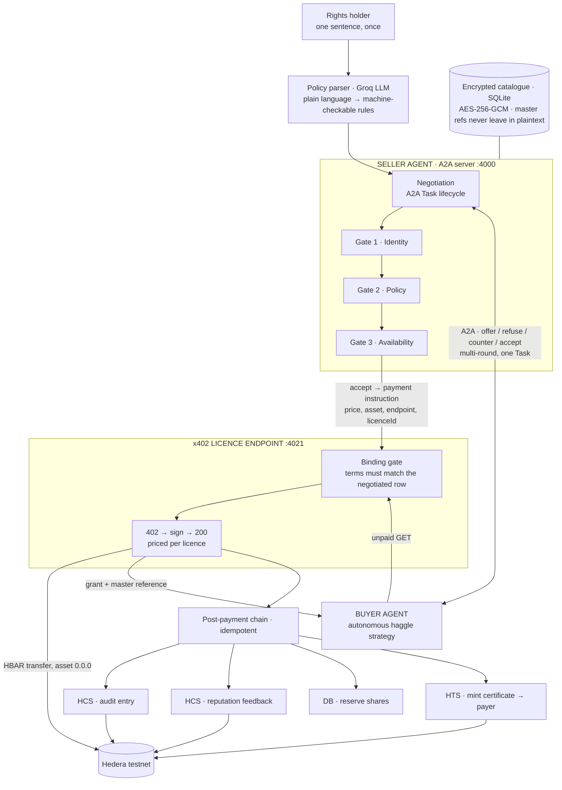
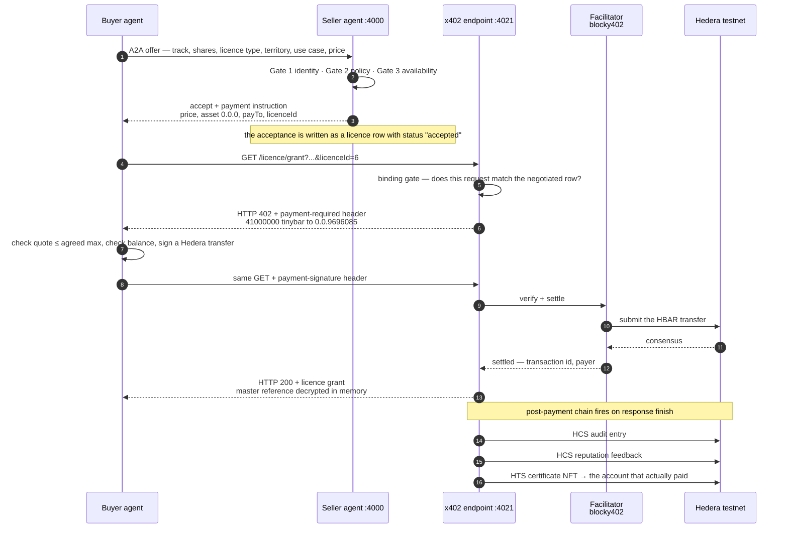

<div align="center">

# Kinora — your music, your terms

**A music rights marketplace where two AI agents negotiate a licence and settle it themselves — on Hedera, with no Solidity anywhere.**

[](https://hashscan.io/testnet)
[](#the-no-solidity-claim-and-how-to-check-it)
[](#how-the-payment-flow-works)
[](#architecture)
[](LICENSE)

*Built at **ETHGlobal Lisbon 2026** — Hedera: AI & Agentic Payments · No Solidity*

</div>

---

A musician writes one sentence:

> *"Sell sync licences for my tracks, at least 0.05 HBAR per share, never more than 50% in total, and never for political advertising."*

From then on their agent handles the business. When a film studio's agent wants 5% of a track, the two agents negotiate over A2A: the seller verifies who it is dealing with against an HCS identity registry, checks the offer against the musician's own words, checks the track still has that much capacity left, and — if all three pass — hands back an x402 payment instruction. The buyer's agent pays a real HBAR micropayment, receives the licence grant with the master reference decrypted, and walks away holding an HTS certificate NFT that proves it.

**No human approves any individual deal.** The musician set the terms once; everything after that is two agents and a ledger.

The refusals matter as much as the sales. Ask for a political-ad licence and the agent turns down the money on the artist's behalf, by name — *"You asked to use this track in political advertising. The rights holder's policy forbids that use. This is not a matter of price."*

| | |
|---|---|
| 🚀 **Run it** | [Setup](#setup) → `npm run dev` → panel on `http://localhost:4100` |
| 💸 **The money path** | [How the payment flow works](#how-the-payment-flow-works) — 402 → sign → 200, with a real settled trace |
| 🏗 **The system** | [Architecture](#architecture) |
| 🎬 **Five-minute demo** | [`docs/demo-script.md`](docs/demo-script.md) |
| ✅ **Requirement-by-requirement** | [`docs/bounty-coverage.md`](docs/bounty-coverage.md) — including what we deliberately did *not* build |
| 🔍 **Don't trust us** | [Verify on HashScan](#verify-it-without-trusting-this-repo) |

---

## Table of contents

- [What this targets](#what-this-targets)
- [Architecture](#architecture)
- [How the payment flow works](#how-the-payment-flow-works)
- [The three gates](#the-three-gates)
- [What each Hedera piece actually does](#what-each-hedera-piece-actually-does)
- [Setup](#setup)
- [Verifying it](#verifying-it)
- [Verify it without trusting this repo](#verify-it-without-trusting-this-repo)
- [Repo layout](#repo-layout)
- [Scope & known limitations](#scope--known-limitations)

---

## What this targets

| Bounty | What we bring |
|---|---|
| **AI & Agentic Payments on Hedera** | Two autonomous agents, real A2A protocol, real x402 micropayments on testnet, HCS-14 agent identity, HCS audit trail, HTS certificates, and a buyer that **haggles by itself** — counters at the seller's disclosed floor, walks away when money is not the problem |
| **No Solidity** | **Zero Solidity, zero contract calls.** Hedera-native services only: HCS (consensus), HTS (tokens), Mirror Node (reads). The identity layer that would normally be an ERC-8004 contract is HCS-14 on a consensus topic instead |

### The No-Solidity claim, and how to check it

There is no `.sol` file, no EVM contract deployment, no contract call, and no `ethers` in our dependency list. Run this over the whole codebase:

```bash
grep -rniE "solidity|\bethers\b|Contract(Execute|Call|Create)Transaction|ContractCallQuery|ContractFunctionParameters|\.sol\b" src scripts --include=*.ts --include=*.html
# exits 1 — no matches across all source files
```

This project began on ERC-8004 (Solidity registries on Hedera's EVM) and the entire EVM layer was **deleted**, not merely bypassed — see `git log` for `refactor: remove the ERC-8004 and EVM layer entirely`. `ethers` still exists transitively *inside* the Hedera SDK's own dependency tree; it is gone from ours, and nothing we wrote imports it.

> **On `@hiero-ledger/sdk`:** the No-Solidity brief names `@hashgraph/sdk`. `@hiero-ledger/sdk` **is that same SDK**, renamed after Hedera donated it to the Linux Foundation's Hiero project — same maintainers, same API, same transactions. We are on the current package name, not a different SDK.

---

## Architecture

Two processes, two Hedera accounts, two identities. The rights holder's agent owns the catalogue and the policy; the buyer's agent owns a wallet and a strategy. They only ever meet over A2A and HTTP.



**What goes on-chain:** the payment, the agent identities and their profiles, the compliance attestation, the audit entry, the reputation feedback, and the licence certificate.
**What never does:** the master recording reference, which stays AES-256-GCM encrypted in the rights holder's own store and is decrypted in memory only, on the way into a paid response.

| Process | Port | Role |
|---|---|---|
| Seller agent | `4000` | A2A server, serves `/.well-known/agent-card.json`, runs the three gates |
| x402 licence endpoint | `4021` | `GET /licence/grant` (paid), `GET /catalog` (free) |
| Demo panel | `4100` | The operator's view: terms, live negotiation, licences sold, audit trail from the mirror node |

`npm run dev` starts all three in **one process** — the policy you save in the panel lives in the seller agent's memory, so they have to share it.

---

## How the payment flow works

This is the part the bounty is about, so here it is end to end: what is priced, who signs, what the endpoint refuses, and what happens after the money lands.

### The shape of it



### 1. The price is negotiated, not posted

The endpoint has **no fixed route price**. Each 402 is quoted from the licence row the request names:

```
price = shares × the track's own per-share rate     (src/data/catalog.ts → quotePrice)
```

A 500-share (5%) licence on a track rated `0.00082 ℏ/share` is quoted `0.41 ℏ` — the same number the seller's acceptance advertised, so the buyer can compare what it agreed to against what it is being asked for. `GET /catalog` stays free on purpose: an agent has to be able to discover the offer before it can decide to pay for it.

### 2. The binding gate runs *before* the price

Ahead of the payment middleware sits `requireAcceptedLicence` (`src/x402/server.ts`). Without it the three gates in the agent would be decorative, because the endpoint would sell a forbidden licence to anyone holding the price. It refuses with `403` and never quotes a price at all when:

| Refusal | When |
|---|---|
| `negotiation_required` | no `licenceId` — nobody negotiated this |
| `unknown_negotiation` | the id names no licence |
| `negotiation_not_open` | the licence was refused, or **already settled** — an acceptance can be paid exactly once |
| `criteria_mismatch` | the requested terms differ from the agreed row *in either direction* — an omitted `territory` cannot silently widen an EU licence to worldwide |

A mismatch deliberately does **not** echo the stored terms back: an agent probing with guesses is not told what the right answer was.

### 3. 402 → sign → 200, with no human in the loop

The buyer half (`src/x402/pay.ts`) is four visible steps rather than a one-line wrapper, because this is the part the demo is about:

1. `GET` the protected URL → **HTTP 402** with a `payment-required` header carrying price, asset and recipient.
2. Decode the requirements. **An autonomous agent must not sign whatever it is handed** — a quote above the agreed maximum is refused outright, and the buyer's balance is checked against the quote before anything is signed, so an underfunded agent fails with a sentence instead of an opaque facilitator error.
3. Sign a Hedera transfer for that exact amount, with the buyer's own key. The key is read once, handed straight to the signer, and never logged, never put in a URL, and never passed to the LLM-driven parts of the agent.
4. Retry the *same* `GET` with a `payment-signature` header → **HTTP 200** and the licence grant.

The seller's server **holds no Hedera key**: verification and settlement are done by the facilitator, so the seller only ever declares where the money should go. Settlement comes back in a `payment-response` header — that is where the transaction id and the real payer come from.

### 4. What happens after the money lands

The post-payment chain runs when the response finishes — the buyer already has its grant, so none of it blocks delivery:

| Step | Service | Note |
|---|---|---|
| Audit entry | HCS | buyer UAID, track, shares, licence type, use case, price, payment transaction |
| Reputation feedback | HCS | about the buyer, citing the transaction so the claim is checkable |
| Reserve shares | SQLite | capacity only moves **after** payment, never at acceptance |
| Mint certificate | HTS | NFT to the account that actually paid — a different payer gets its own certificate |

It is **idempotent**: a completed-guard runs first, so a replay writes no second audit entry, no second feedback and mints nothing.

### 5. A real settled licence

Every number below is from one run of this repo, through the panel, on Hedera testnet:

```
buyer  → offers 0.5 ℏ for a sync licence on track 1 — 500 shares (5%), for film
seller → negotiation: accept
x402     -> GET http://localhost:4021/licence/grant?trackId=1&shares=500&licenceType=sync&useCase=film&licenceId=6
x402     <- HTTP 402
x402        asking 0.41 ℏ (41000000 tinybar, asset 0.0.0) to 0.0.9696085 on hedera:testnet
x402        signed by 0.0.9697053 — retrying with payment
x402     <- HTTP 200
x402     settlement: success=true payer=0.0.9697053
x402     transaction: 0.0.7162784@1785047564.932543869
buyer  ← licence granted — 5% of "Harbour Lights, Slower" by Mira Kestrel, master ref released
hedera   audit trail, reputation and certificate recorded — licence #6 marked completed
```

- **Payment:** [`0.0.7162784-1785047564-932543869`](https://hashscan.io/testnet/transaction/0.0.7162784-1785047564-932543869) — 0.41 ℏ to the rights holder, no human approval anywhere in it
- **Audit entry:** sequence `#734` on topic [`0.0.9738154`](https://hashscan.io/testnet/topic/0.0.9738154) — `licence_completed — track 1 · 500 shares (5%) · sync · film`
- **Attestation:** `validation_request #731` / `validation_response #733, score 100` on the identity topic, written during the same negotiation
- **Certificate:** serial `#16` in collection [`0.0.9756726`](https://hashscan.io/testnet/token/0.0.9756726), minted to the buyer

### 6. The royalty, and why it has no fallback fee

A licence certificate carries a **5% royalty to the rights holder**, baked into the collection at creation with no fee schedule key, so the terms cannot be changed afterwards. Hedera assesses that royalty only when an NFT changes hands **in exchange for fungible value inside a single transfer**, which produces a deliberate asymmetry:

- **Delivery charges nothing.** When a sale completes, the certificate moves treasury → buyer with no HBAR alongside it; the licence was already paid for over x402. A *fallback fee* would have billed the buyer a second time for a licence they had just bought. So there is no fallback fee.
- **Resale pays the artist.** When the holder sells the certificate onward for HBAR, the ledger takes 5% and routes it to the rights holder automatically.

Demonstrated, not merely configured — `npm run verify:royalty` performs both halves live and asserts the difference (**7/7**):

```
delivery  treasury → buyer, no value        → no royalty assessed
resale    buyer → third account for 10 ℏ    → 0.5 ℏ to the rights holder
```

Proof: [`0.0.9697053-1785023666-767928814`](https://hashscan.io/testnet/transaction/0.0.9697053-1785023666-767928814) — `assessed_custom_fees` shows `50000000` tinybar to `0.0.9696085`, charged to the account that received the payment. The rights holder was **not a party to that sale**; the script creates a throwaway third account precisely so the royalty cannot be confused with money moving between the two demo accounts. The resale is a **separate verification, not a beat in the demo flow** — nothing in the negotiation path resells anything.

**Every certificate the demo issues carries this royalty:** `HTS_LICENCE_TOKEN_ID` points at the royalty-bearing collection, so the NFT a buyer walks away with is the same one that would pay the artist on resale. Check it the way a sceptic would — take a certificate serial off the panel's Licences-sold row and look the token up on the mirror node; `custom_fees.royalty_fees` must be non-empty.

---

## The three gates

Every offer passes through three checks, in order. Each one can only ever *narrow* what happens next, and each refusal says why in a sentence a person can read.

| # | Gate | Question | Refusal codes |
|---|---|---|---|
| **1** | **Identity** | Is this buyer who it says it is? Four checks against the HCS identity registry: the UAID parses, the registry holds a profile, that profile is active, and a compliance attestation scores 100. Each fails closed — *"the registry says no"* and *"the registry is unreachable"* are deliberately different answers, so an outage can never masquerade as a verdict. | `identity_unverified` |
| **2** | **Policy** | Does the rights holder's own sentence permit this deal? Licence type, forbidden use, share cap, price floor. | `offer_incomplete`, `licence_type_not_permitted`, `use_case_forbidden`, `share_cap_exceeded`, `price_too_low` |
| **3** | **Availability** | Does the track still have that many shares to give? Checked **before** any payment instruction is issued, so nobody pays for a licence the catalogue could not grant. | `insufficient_shares`, `unknown_track` |

A fourth gate sits at the money — the binding gate described [above](#2-the-binding-gate-runs-before-the-price).

**Only a price refusal discloses the floor.** A licence-type or use-case refusal says *"this is not a matter of price"* and reveals nothing further — so an agent cannot map the catalogue by probing with bids. That disclosed floor is also what makes the buyer's counter-offer grounded rather than a guess.

---

## What each Hedera piece actually does

| Service | Where | What it does here |
|---|---|---|
| **HCS — consensus** | `src/hedera/audit.ts` | Every completed licence writes a public, tamper-evident entry: buyer UAID, track, shares, licence type, use case, price, payment transaction |
| **HCS — identity registry** | `src/identity/registry.ts`, `profile.ts` | Agent profiles (DID-Document-shaped) published to a topic; gate 1 resolves them back through the mirror node |
| **HCS — attestation** | `src/identity/attestation.ts` | A `validation_request` / `validation_response` pair per negotiation, using the ERC-8004 ValidationRegistry's own field names on a consensus topic instead of a contract |
| **HCS — reputation** | `src/identity/reputation.ts` | After a settled payment, feedback about the buyer, citing the transaction so the claim is checkable |
| **HTS — tokens** | `src/hedera/certificate.ts` | The licence certificate NFT — **the product's on-chain half**, minted to whoever actually paid. Metadata `{"t":1,"sh":500,"l":"sync","hcs":376}` (36 bytes of a 100-byte cap) |
| **HTS — royalty fee** | `scripts/create-licence-token.ts` | The 5% royalty to the rights holder on any onward sale, with no fee schedule key |
| **Mirror Node** | `src/hedera/mirror.ts`, `src/web/api.ts` | Every read: identity resolution, the audit panel, test assertions. The panel shows what Hedera recorded, not what the app believes happened |
| **x402** | `src/x402/server.ts`, `pay.ts` | 402 → sign → 200. Priced **per licence**, never a flat route price |
| **A2A** | `src/a2a/` | AgentCard discovery, real Task lifecycle, multi-round negotiation — a declined offer leaves the task `input-required`, so a counter-offer lands in the *same* conversation |
| **Hedera Agent Kit** | `src/hedera/agentkit.ts` | `AgentMode.AUTONOMOUS` toolkit with the HCS audit-trail hook — demonstrated by `scripts/test-agent-kit.ts`; the negotiation path uses the SDK directly |

---

## Setup

You need **Node 22** (what this was built and run on), two Hedera **testnet** accounts, and a free Groq key. Everything runs on testnet — no real funds move.

### Quickstart

```bash
git clone https://github.com/SweetieBirdX/Kinora.git && cd Kinora
npm install
cp .env.example .env          # fill it in — see the table below

npx tsx scripts/check-balance.ts          # 1. is the network reachable?
npx tsx scripts/create-audit-topic.ts     # 2. → HCS_AUDIT_TOPIC_ID
npx tsx scripts/create-identity-topic.ts  # 3. → HCS_IDENTITY_TOPIC_ID
npx tsx scripts/create-licence-token.ts   # 4. → HTS_LICENCE_TOKEN_ID (also associates the buyer)
npx tsx scripts/register-agents-hcs.ts    # 5. → agent-uaids.json
npx tsx scripts/seed-catalog.ts           # 6. → catalogue.db, 7 fictional tracks

npm run dev                               # panel at http://localhost:4100
```

Steps 2–4 each print a line to paste into `.env`; every step needs the one before it.

### The environment

| Variable | Where it comes from |
|---|---|
| `SELLER_ACCOUNT_ID` / `SELLER_PRIVATE_KEY` | [portal.hedera.com](https://portal.hedera.com/dashboard) — testnet account, **ECDSA** |
| `BUYER_ACCOUNT_ID` / `BUYER_PRIVATE_KEY` | A **second** testnet account — the two agents must be genuinely separate parties |
| `GROQ_API_KEY` | [console.groq.com/keys](https://console.groq.com/keys) — free, no card |
| `X402_FACILITATOR_URL` | `https://api.testnet.blocky402.com` — no signup |
| `X402_PAY_TO_ACCOUNT` | Same as `SELLER_ACCOUNT_ID` |
| `DATA_ENCRYPTION_KEY` | Any passphrase; it never leaves your machine |
| `HCS_AUDIT_TOPIC_ID`, `HCS_IDENTITY_TOPIC_ID`, `HTS_LICENCE_TOKEN_ID` | Printed by the setup scripts above |

> Run the demo with `npm run dev`, **not** three separate terminals. The policy you save in the panel lives in the seller agent's memory, so the panel and the agent have to be the same process for a saved policy to actually change what the agent does.

---

## Verifying it

```bash
npm run test:catalog     # availability, pricing, grants, policy parsing — 25 checks, buys nothing
npm run test:errors      # failure modes: bad ids, unreachable endpoints, empty policy — 18 checks
npm run test:identity    # the four identity checks against the live registry — 33 checks, HCS fees only
npm run test:e2e         # full negotiation → payment → grant → chain — 22 checks, spends real HBAR
npm run test:rounds      # multi-round haggle inside one A2A task — spends real HBAR
npm run verify:royalty   # the 5% royalty firing on a real resale — 7 checks, spends real HBAR
```

`test:e2e`, `test:rounds` and `verify:royalty` make real testnet payments and append real HCS entries, so they are neither free nor idempotent — that is rather the point of them. The first two also take shares out of a track's capacity permanently, and `verify:royalty` creates a throwaway account and mints a certificate outside the negotiation path. `test:identity` writes real attestations (HCS fees, fractions of a cent) but buys nothing; `test:catalog` and `test:errors` spend nothing at all.

The most convincing check is the panel's fourth pane: it lists the audit trail pulled from the **mirror node**, the same source HashScan renders. Every entry can be verified independently of anything this app claims.

## Verify it without trusting this repo

| What | Id |
|---|---|
| Rights holder account | [`0.0.9696085`](https://hashscan.io/testnet/account/0.0.9696085) |
| Buyer account | [`0.0.9697053`](https://hashscan.io/testnet/account/0.0.9697053) |
| HCS audit topic | [`0.0.9738154`](https://hashscan.io/testnet/topic/0.0.9738154) |
| HCS identity topic | [`0.0.9749380`](https://hashscan.io/testnet/topic/0.0.9749380) |
| HTS certificate collection | [`0.0.9756726`](https://hashscan.io/testnet/token/0.0.9756726) |
| A settled licence payment | [`0.0.7162784-1785047564-932543869`](https://hashscan.io/testnet/transaction/0.0.7162784-1785047564-932543869) |
| The royalty firing on a resale | [`0.0.9697053-1785023666-767928814`](https://hashscan.io/testnet/transaction/0.0.9697053-1785023666-767928814) |

---

## Repo layout

```
src/a2a/          seller agent card, executor (the three gates), A2A server, buyer client + haggle strategy
src/identity/     HCS-14 UAIDs, agent profiles, registry publish/resolve, attestation, reputation, gate 1
src/data/         encrypted catalogue (db.ts), availability + pricing + licence grants (catalog.ts)
src/policy/       plain language → LicencePolicy, via Groq
src/hedera/       clients, HCS audit log, mirror-node reads, HTS certificates, Agent Kit toolkit
src/x402/         paid licence endpoint, payment binding gate, buyer-side payment
src/web/          demo panel (API + single-page UI)
src/types/        the marketplace contract both halves compile against
scripts/          one-time setup, seeding, and the test suites
frontend/         the landing page (Vite + React), separate from the panel
docs/             demo script, bounty coverage
```

---

## Scope & known limitations

Where the claims above stop, stated plainly — a judge who knows these standards will ask anyway.

- **HCS-14 conformance is partial, and here is the exact subset.** We implement the UAID **format** (`did:uaid:{id};proto=…;nativeId=hedera:testnet:{account};uid=…`), the **id sanitisation rule** (everything from the first `;`, `?` or `#` onwards is stripped), the `nativeId` binding to a real Hedera account, and parse/serialise round-tripping. What we do **not** do: HCS-14 says the id segment is the sanitised method-specific identifier of an **existing W3C DID**. Our agents have no pre-existing `did:key`, so we derive the id from `sha256("hedera:testnet:" + accountId)` in base64url — deterministic and collision-free for our purposes, but **self-derived**, so this is HCS-14-shaped rather than HCS-14-conformant. The registry topic is likewise our own choice: the standard mandates none, and we publish profiles to one so identity can be checked through the mirror node rather than taken on our word.
- **The compliance attestation is self-issued.** The seller attests the buyer against its own allow-list and writes the result to a consensus topic — a real, public, tamper-evident record, but **not third-party verification**. It lives on HCS because the ERC-8004 ValidationRegistry **has no deployment on any chain** (that spec section is still under revision), so there was no contract to call anywhere. We use the registry's own field names, so swapping the substrate would be a migration, not a redesign.
- **The buyer's haggle is rule-based, not an LLM.** Three rules: counter only when the refusal is about price, counter at the seller's disclosed floor, treat the budget as a hard wall. Light strategy, deliberately — there is no model call inside the negotiation loop. The LLM's job is the rights holder's sentence, not the bargaining.
- **The catalogue is fictional.** All seven tracks, all five artists, and every master reference in `scripts/seed-catalog.ts` are invented. No real recording, performer, or release is represented, and the "master references" are fake URLs whose only job is to be something that stays encrypted until a licence is paid for.
- **Everything runs on Hedera testnet.** No real funds move, and no real revenue, users, or licensing partners are implied.

Operational caveats that do not change what the system claims — the in-memory task store, the certificate association a new buyer needs, and how the policy floor relates to the track quote — are in [`docs/bounty-coverage.md`](docs/bounty-coverage.md).

---

## Demo video

*To be added before submission.*

---

Apache-2.0. Built at ETHGlobal Lisbon 2026.
